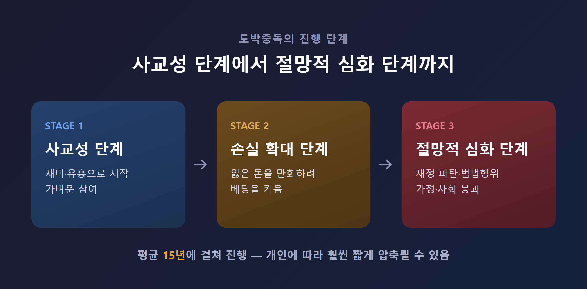
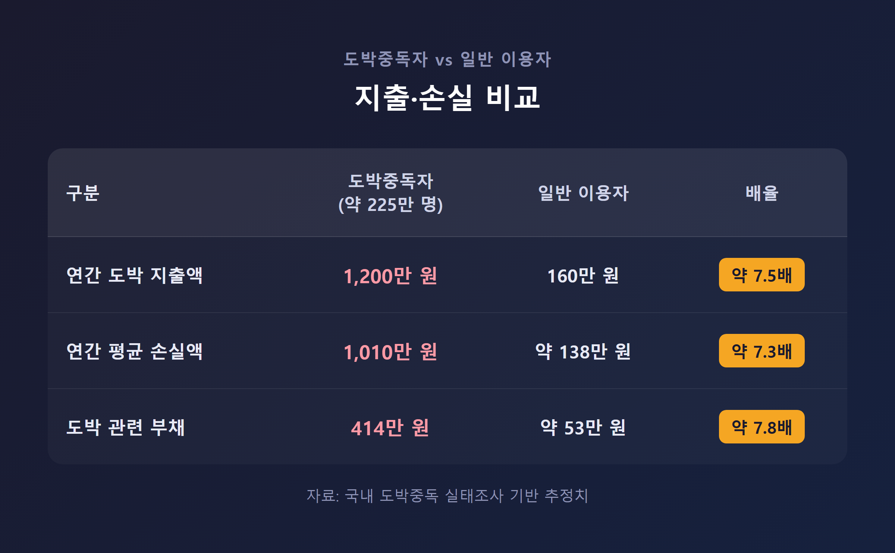
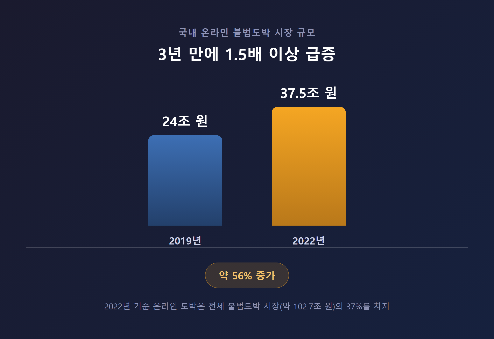
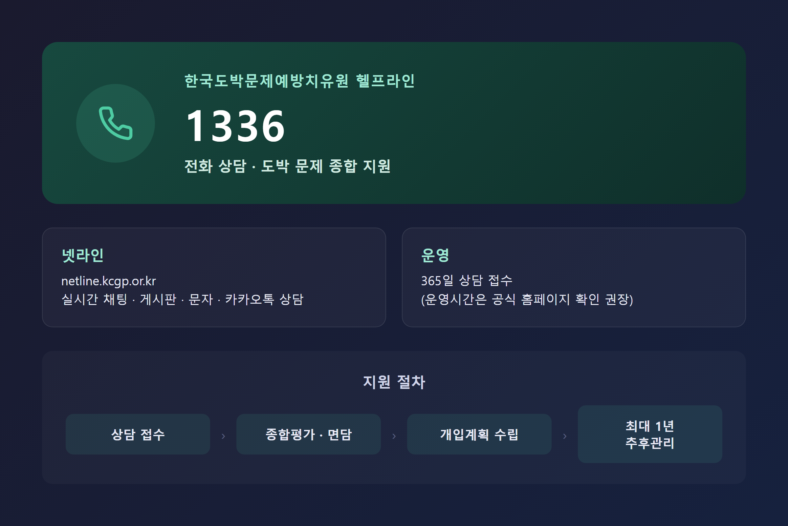

━━━━━━━━━━━━━━━━━━━━━━━━━━━━━━━━━━━━━━━━
[건강정보] 도박을 하면 안되는 이유 — 뇌과학과 통계가 말해주는 진짜 위험
━━━━━━━━━━━━━━━━━━━━━━━━━━━━━━━━━━━━━━━━

솔직히 말씀드리면, 저는 도박을 직접 해본 적이 없습니다.

그래서 이 주제를 조사하기 전까지는 "의지가 약해서 못 끊는 거 아닌가" 정도로 막연하게 생각했던 것도 사실입니다.

그런데 자료를 하나씩 찾아보면서 생각이 완전히 바뀌었는데요. 도박을 하면 안되는 이유는 단순히 "돈을 잃어서"가 아니라, 뇌의 작동 방식 자체를 바꿔버리고, 개인을 넘어 가족과 사회 전체에 값비싼 청구서를 내미는 구조 때문이었습니다.

이 글은 도박을 하면 안되는 이유를 크게 네 가지 축 — 뇌과학, 경제적 파탄, 가족과 관계, 온라인 도박의 위험성 — 으로 정리한 글입니다. 결론부터 말씀드리면, 도박은 "따고 잃고"의 문제가 아니라 뇌 구조와 삶 전체가 서서히 재편되는 문제입니다.

---

■ 도박을 하면 안되는 이유, 뇌가 먼저 알고 있습니다

가장 먼저 짚고 싶은 건 도박중독이 그냥 "습관"이 아니라는 점입니다.

미국정신의학회(APA)는 이미 1980년에 병적 도박을 충동조절 장애로 분류했고, 현재 DSM-5에서는 알코올·마약과 같은 '물질관련 및 중독 장애' 범주에 넣고 있습니다. 국립정신건강센터 설명에 따르면 도박은 재미로 시작하는 사교성 단계에서, 손실을 만회하려는 손실 확대 단계를 거쳐, 재정 파탄과 범법행위까지 이어지는 절망적 심화 단계로 진행됩니다. 이 과정이 보통 15년에 걸쳐 진행되지만, 사람에 따라 훨씬 짧게 압축될 수 있다는 설명도 함께 나옵니다.

왜 이렇게 되는 걸까요.

핵심은 배팅 버튼을 누르고 결과를 "기다리는 시간"에 있습니다. 도파민 보상 회로는 돈을 따든 잃든 이미 최대치로 활성화되는데요. 즉 결과 자체보다 결과를 기다리는 불확실성이 뇌를 자극하는 진짜 요인이라는 것입니다. 그래서 도박은 일반적인 소비 행동보다 중독성이 훨씬 강하다는 설명이 나옵니다.

여기서 끝이 아닙니다. fMRI 연구에 따르면 도박 중독자는 의사결정과 충동 조절을 담당하는 전전두엽 피질의 활성도가 정상인보다 낮게 나타납니다. 중독이 진행될수록 뇌세포가 위축되고 뇌 부피 자체가 줄어드는 구조적 변화까지 동반되며, 기억력 저하와 성격 변화, 수면-각성주기 이상, 판단력 저하가 함께 찾아옵니다. 국내 연구팀은 대뇌 측좌핵의 특정 단백질을 조작해 위험 선택 행동 자체를 바꿀 수 있다는 것도 동물 실험으로 확인했는데요.

이 대목에서 제가 놀랐던 건, 도박중독이 "의지의 문제"가 아니라 "뇌의 생물학적 기전에 의한 질환"으로 설명된다는 점이었습니다.

의지가 약해서 못 끊는 게 아니라 — 뇌가 이미 그렇게 재편되어 있어서 못 끊는 것입니다.

---

■ 통장이 먼저 무너집니다 — 개인과 사회가 함께 치르는 비용

도박이 위험한 이유를 숫자로 보면 훨씬 선명해집니다.

국내 도박 중독자(추정 225만 명)의 연간 도박 지출액은 평균 1,200만 원으로, 일반 이용자(160만 원)의 약 7.5배에 달합니다. 평균 손실액도 1,010만 원으로 일반 이용자의 7.3배, 도박 관련 부채는 414만 원으로 7.8배 수준입니다. 도박중독자의 10.1%는 이미 신용불량 상태이고, 6.3%는 개인회생·파산 절차를 밟았거나 밟고 있으며, 10.5%는 도박 때문에 실직이나 폐업을 경험했습니다.

개인 차원의 피해만이 아닙니다. 한 조사에 따르면 도박중독으로 인한 한국의 사회적 총비용은 연간 25조 4,532억 원으로 추정되는데요. 이 중 생산성 감소가 21조 5,920억 원으로 전체의 84.4%를 차지합니다. 도박에 빠진 사람이 일터에서 제 몫을 못 하는 순간, 그 손실은 결국 사회 전체가 나눠 지게 되는 셈입니다. (다만 산정 연도와 방법론이 다른 자료에서는 이 비용을 78조 원대로 보기도 합니다. 두 수치 모두 "수십조 원 규모의 막대한 비용"이라는 점에서는 일치하지만, 정확한 산출 근거까지 완전히 일치시키지는 못했다는 점은 정직하게 밝혀두고 싶습니다.)

그런데 정부의 대응은 이 규모를 따라가지 못하고 있는데요. 2024년 기준 도박중독 예방·치료 예산은 약 120억 원으로, 알코올중독 예산의 절반 수준에 불과합니다. 그 결과 재도박률은 25%에 달하고, 완전히 끊는 데 성공하는 비율은 10%에 그칩니다.

여기에 불법도박 시장까지 더하면 그림은 더 어두워집니다. 2022년 실태조사 기준 국내 불법도박 시장 규모는 약 102조 7,000억 원으로, 3년 전보다 21조 2,000억 원 늘었습니다. 이 중 온라인 도박이 37%를 차지하며, 2019년 24조 원이었던 온라인 도박 시장은 2022년 37조 5,000억 원까지 급증했습니다.

---

■ 도박은 혼자 무너지지 않습니다 — 가족, 관계, 그리고 자살 위험

도박이 왜 위험한지 이야기할 때, 제가 가장 마음이 무거워졌던 부분입니다.

도박중독은 절대 개인의 문제로 끝나지 않습니다. 한국형사정책연구원의 2020년 보고서에 따르면 도박중독자 가족의 42.3%가 불면증, 우울, 공황장애 등을 경험했다고 합니다. 배우자의 도박으로 생활비와 자녀 학원비까지 밀려 대출을 받고 신용불량자로 전락한 가족의 사례도 실제로 보도된 바 있습니다.

가족 치료 현장에서는 가족의 과도한 간섭이나 건강하지 못한 의사소통이 오히려 재발을 부추길 수 있다는 지적도 나옵니다. 그만큼 도박중독은 당사자 한 사람의 회복 의지만으로는 해결되지 않고, 가족 전체가 함께 다뤄야 하는 문제라는 뜻이기도 합니다.

가장 무거운 수치는 자살 위험입니다.

한국도박문제관리센터 통계에 따르면 도박중독 경험자의 약 32%가 자살 충동을 느낀 적이 있고, 이 중 6%는 실제로 자살을 시도한 경험이 있습니다. 도박 심각도가 높을수록 자살 생각이 늘어나고, 그 사이를 도박 빚에 대한 압박감이 매개한다는 연구 결과도 있는데요. 다행히 가족의 정서적 지지가 이 위험을 완화하는 조절 효과를 갖는다는 점도 함께 보고됩니다.

학교 밖 청소년의 경우 도박 문제를 겪을 때 자살 생각과 시도 수준이 재학 청소년보다 더 심각하게 나타난다는 연구 결과도 있습니다. 청소년이라고 예외가 아니라는 뜻입니다.

---

■ 스마트폰 안의 도박, 왜 더 위험할까요

"도박"이라고 하면 카지노나 오프라인 도박판을 먼저 떠올리기 쉬운데요. 그런데 지금 가장 빠르게 커지고 있는 건 온라인·불법 도박입니다.

최근 보도만 봐도 심각성이 드러납니다. 훔친 개인정보로 다른 도박사이트에 회원 796명을 무단 가입시킨 운영자가 징역 1년을 확정받았고, 해외로 도피해 조 단위 불법도박사이트를 운영한 총책이 12년 만에 검거되어 송환되기도 했습니다. 온라인 도박이 단순한 유흥이 아니라 국제 범죄 조직과 연결된 산업이라는 뜻입니다.

문제는 피해가 드러나기도 어렵다는 점입니다. 온라인 사기 피해 신고율은 27.2%에 불과하고, 개인정보 유출·네트워크 피해 신고율은 4.5%로 더 낮습니다. 인구 10만 명당 재산범죄 피해는 2016년 3,168건에서 2023년 6,609건으로 두 배 넘게 늘었는데, 이 증가를 온라인 사기 같은 범죄가 주도하고 있습니다.

더 걱정스러운 건 청소년입니다. 2025년 청소년 도박 실태조사에 따르면 청소년 평생 도박 경험률은 4.0%로 소폭 줄었지만, 추산 약 15만 7천 명이 도박을 경험했고 약 3만 명은 최근까지도 지속하고 있습니다. 도박 경험자 중 최근 6개월 내 지속 경험률은 오히려 19.4%로 전년보다 늘었습니다. 가장 많이 접한 유형은 온라인 카지노 게임(35.8%)이었고, "재미있을 것 같아서"(58.5%)가 시작 이유 1위였습니다.

청소년의 절반이 넘는 54.0%가 도박 광고나 홍보물에 노출된 적이 있다는 것도 눈여겨볼 대목입니다. 인터넷 배너·팝업 광고, 문자메시지, SNS 게시물을 통해 도박이 이렇게까지 가까이 와 있다는 뜻이니까요.

---

■ 그래도 끊고 싶다면 — 도움 받을 수 있는 곳

여기까지 읽으셨다면 아마 "그럼 이미 시작한 사람은 어떻게 해야 하나"라는 질문이 떠오르실 것 같습니다.

다행히 국내에는 전문 지원 체계가 있습니다. 한국도박문제예방치유원(KCGP)이 운영하는 헬프라인 1336은 전화 상담을, 넷라인(netline.kcgp.or.kr)은 실시간 채팅·게시판·문자·카카오톡 상담을 365일 제공합니다. 전화나 온라인으로 접수하면 지역센터·민간상담기관과 연계돼 종합평가와 면담을 거친 뒤 개입계획이 세워지고, 정규상담이 끝난 뒤에도 최대 1년간 추후관리가 이어집니다.

지역 중독관리통합지원센터에서도 도박을 포함한 4대 중독 상담을 받을 수 있고, 단도박회(GA) 같은 자조모임도 회복에 도움이 됩니다. 치료는 약물치료(SSRI, 항갈망제 등)와 인지행동치료, 동기강화치료, 가족치료, 재정·시간 관리 개입을 함께 병행하는 경우가 많습니다.

재도박률 25%, 단도박 성공률 10%라는 수치를 앞서 말씀드렸는데요. 낮아 보일 수 있지만, 뒤집어 보면 전문적인 개입을 받은 사람 중 상당수가 회복의 길을 걷고 있다는 뜻이기도 합니다. 혼자 버티기보다 도움을 요청하는 쪽이 훨씬 승산이 높습니다.

---

■ 정직하게 덧붙이자면

이 글을 준비하면서 자료들끼리 서로 다른 숫자를 말하는 경우도 있었다는 걸 밝혀두고 싶습니다.

사회적 비용을 25조 원대로 보는 자료와 78조 원대로 보는 자료가 함께 존재했고, 조사 연도와 방법론 차이 때문에 두 수치를 완전히 하나로 맞추지는 못했습니다. 도박중독자의 자살률이 "20% 이상"이라는 서술도 일부 자료에서 확인되지만, 1차 공식 통계 출처까지는 명확히 특정하지 못해 참고 수준으로만 남겨두었습니다. 헬프라인 1336의 운영시간도 자료마다 "24시간"과 "09시~22시"로 다르게 표기돼 있어, 실제 이용 전에는 공식 홈페이지 확인을 권해드립니다.

숫자 하나하나까지 완벽하게 통일하지는 못했지만, 그럼에도 이 모든 자료가 가리키는 방향은 하나였습니다. 도박을 하면 안되는 이유는 차고 넘치고, 그 근거는 뇌과학에서 통계, 가족의 증언까지 겹겹이 쌓여 있다는 것입니다.

---

도박을 하면 안되는 이유를 한 줄로 정리하면, 도박은 뇌를 바꾸고, 통장을 비우고, 가족을 흔들고, 그 청구서를 사회 전체가 나눠 낸다는 것입니다.

혹시 지금 "이 정도는 괜찮겠지"라는 생각이 든다면, 혹은 주변에 그런 사람이 있다면, 헬프라인 1336에 전화 한 통 걸어보시길 권해 드립니다. 그 한 통이 15년 걸릴 수도 있는 과정을 훨씬 짧게 끊어낼지도 모릅니다.

━━━━━━━━━━━━━━━━━━━━━━━━━━━━━━━━━━━━━━━━
