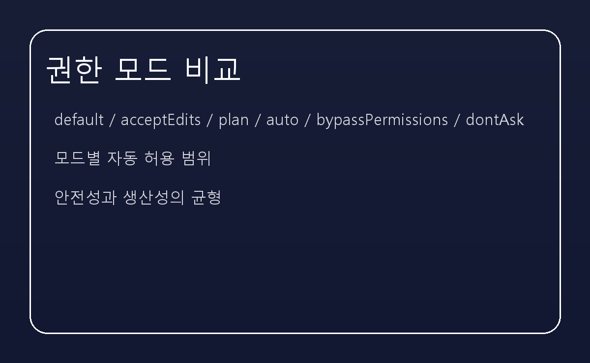
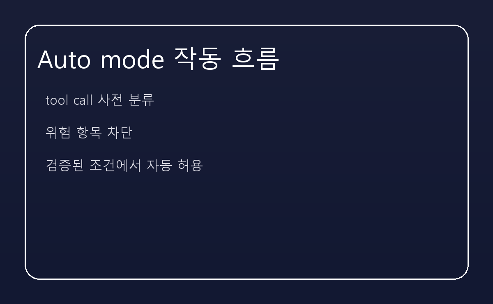

━━━━━━━━━━━━━━━━━━━━━━━━━━━━━━━━━━━━━━━━
[AI] 클로드 코드의 핵심 기능 5가지 — 권한 모드부터 자동 분류까지
━━━━━━━━━━━━━━━━━━━━━━━━━━━━━━━━━━━━━━━━

솔직히 말씀드리면, 클로드 코드를 처음 봤을 때 저는 단순한 코드 자동화 도구라고 생각했습니다. 그런데 실제로 들여다보니, 이 시스템이 가장 신경 쓴 지점은 **권한과 안전을 어떻게 설계하느냐**였습니다.

클로드 코드의 핵심은 크게 다섯 가지로 정리할 수 있습니다. 그중에서도 가장 중요한 것은, **자동화 전에 권한 흐름을 먼저 정해 두었다는 점**입니다.

---

■ 권한 모드를 먼저 나눈 이유

일반적인 AI 코딩 도구는 '코드 생성'에 초점을 맞춥니다. 그런데 클로드 코드는 그 이전 단계에서 **이 명령을 실행해도 되는가**를 먼저 묻습니다.

이 도구에는 `default`, `acceptEdits`, `plan`, `auto`, `bypassPermissions`, `dontAsk` 같은 모드가 있습니다. 각각은 자동 허용 범위가 다르고, 사용자의 신뢰 수준에 따라 점진적으로 풀어줍니다.

---

■ 첫 번째 핵심: 권한 모드 시스템

가장 눈에 띄는 것은 **권한 모드를 명확히 구분한 구조**입니다. 예를 들면 `acceptEdits`는 워킹 디렉터리 내 파일 편집과 기본 파일 시스템 작업을 자동으로 허용합니다.

이 모드는 코드 리뷰가 많은 프로젝트에서 특히 효과적입니다. 자잘한 파일 생성/이동/복사 작업을 승인 대기 없이 처리할 수 있으니까요.

---

■ 두 번째 핵심: Auto mode의 분류기 안전 검증

auto 모드는 무조건 풀어주는 모드가 아닙니다. 이 모드는 **각 `tool call`을 분류기가 사전 평가하고, 위험한 항목을 걸러내는 방식**입니다.

여기서 차단하는 내용은 꽤 명확합니다. 외부 코드 다운로드 및 실행, 민감 데이터 전송, 프로덕션 배포, 대량 삭제, 권한 변경, 공유 인프라 수정, 세션 이전 파일의 비가역적 삭제, 강제 푸시 등이 대표적입니다.

---

■ 세 번째 핵심: acceptEdits 모드의 실전 가치

acceptEdits가 단순히 파일 편집을 편하게 해주는 이유는, **일반 개발자가 체감하는 피로를 줄이기 때문**입니다.

이 모드는 워킹 디렉터리 내 작업에 한정해 자동 승인을 허용합니다. 그래서 불필요한 권한 승인을 보지 않으면서, 반복적인 수정이나 리팩터링을 빠르게 진행할 수 있습니다.

---

■ 네 번째 핵심: plan 모드의 사전 분석 흐름

plan 모드는 '먼저 계획을 세우고, 나중에 실행'하는 방식입니다. Claude가 제안한 작업과 결과를 먼저 보여주고, 사용자가 검토한 뒤 승인하도록 합니다.

이 흐름은 복잡한 변경이나 민감한 작업에서 특히 유용합니다. 즉시 실행하는 대신, 결과를 먼저 확인할 수 있다는 점에서 안전성을 높입니다.

---

■ 다섯 번째 핵심: 보호 경로 및 권한 규칙 요약

클로드 코드는 자동화가 넓어질 때도 중요한 경로를 지키는 원칙을 갖고 있습니다. `.git`, `.vscode`, `.idea`, `.devcontainer`, `.claude` 같은 디렉터리는 자동 승인 대상에서 빠집니다.

또한 `allow`와 `deny` 규칙을 통해 특정 명령을 세밀하게 제어할 수 있습니다. 이로 인해 auto 모드에서도 무분별한 권한 확장이 방지됩니다.

---

■ 이 기능이 주는 의미

결국 클로드 코드는 **권한 모드 분리와 분류기 기반 검증**이라는 두 축을 중심으로 설계된 도구입니다. 이 구조는 단순한 코드 생성 자동화를 넘어서, 안전한 실행까지 고려하는 접근입니다.

이 글을 읽는다면, 먼저 `auto`와 `acceptEdits`의 차이를 이해하고, `plan` 모드를 적절히 활용해 보시길 권해 드립니다.
